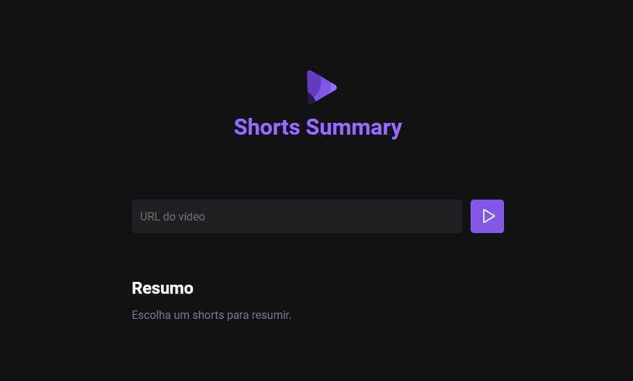

<h1 align="center"> Shorts Summary </h1>

<p align="center">
Programa exclusivo e gratuito, promovido pela Rocketseat para ensino de tecnologias WEB e Inteligencia Artificial. <br/>
</p>

<p align="center">
  <a href="#-tecnologias">Tecnologias</a>&nbsp;&nbsp;&nbsp;|&nbsp;&nbsp;&nbsp;
  <a href="#-projeto">Projeto</a>
</p>

<br>

<p align="center">
  
</p>

## 🚀 Tecnologias

Esse projeto foi desenvolvido com as seguintes tecnologias:

- HTML e CSS
- JavaScript
- Inteligencia Artificial
- Node
- Git e Github
- Figma

## 💻 Projeto

O Shorts Summary é um resumidor de vídeos Shorts do Youtube para visualizar o projeto, basta baixa-lo e executar os seguintes comandos:

<br>

## Iniciando o servidor:
```sh
npm run server
```
Deverá aparecer uma mensagem do tipo:
```sh
> nwl@0.0.0 server
> env YTDL_NO_UPDATE=1 node --watch --no-warnings server/index.js

Server is running on port 3333
```
<br>

## Iniciando a aplicação:
```sh
npm run web
```
Deverá aparecer uma mensagem do tipo:
```sh
VITE v4.4.9  ready in 240 ms

  ➜  Local:   http://localhost:5173/
  ➜  Network: use --host to expose
  ➜  press h to show help
```
<br>

<p>Agora, para visualizar a aplicação, basta abrir o link local mostrado acima, no caso do exemplo http://localhost:5173/!</p>

---

Feito com 💜 by Rocketseat [Participe da nossa comunidade!](https://discord.gg/rocketseat)
